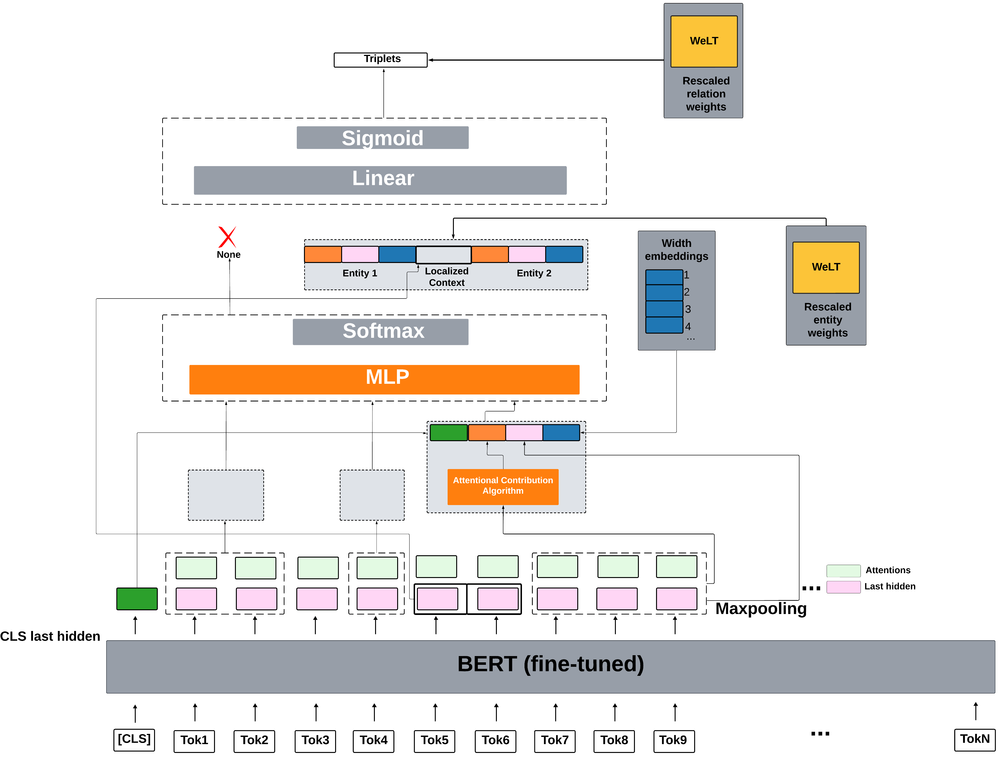

# WeLT-ASpERT: Attention Weight Mechanism JNERE Using WeLT
Authors: Ghadeer Mobasher*, Olga Krebs, Wolfgang Müller, and Michael Gertz 



## Installation 
**Dependencies**
Please make sure to install all required [dependencies](https://github.com/mobashgr/WeLT-ASpERT/blob/main/requirements.txt).

## Data Preparation
Fetch Data :
```
bash ./scripts/fetch_datasets.sh
```
## Example
Train CoNLL04 data :
```
python main.py train --config configs/conll04_train.conf
```
 ## Citation
 Manuscript in preparation (TBD)

## References
1. Markus Eberts, Adrian Ulges. Span-based Joint Entity and Relation Extraction with Transformer Pre-training. 24th European Conference on Artificial Intelligence, 2020.
2. Jianquan Ouyang, Jing Zhang, Tianming Liu. Attention Weight is Indispensable in Joint Entity and Relation Extraction. Intelligent Automation and Soft Computing, 2022.

## Acknowledgment
Ghadeer Mobasher* is part of the [PoLiMeR-ITN](http://polimer-itn.eu/) and is supported by the European Union’s Horizon 2020 research and innovation program under the Marie Skłodowska-Curie grant agreement PoLiMeR, No 812616.
